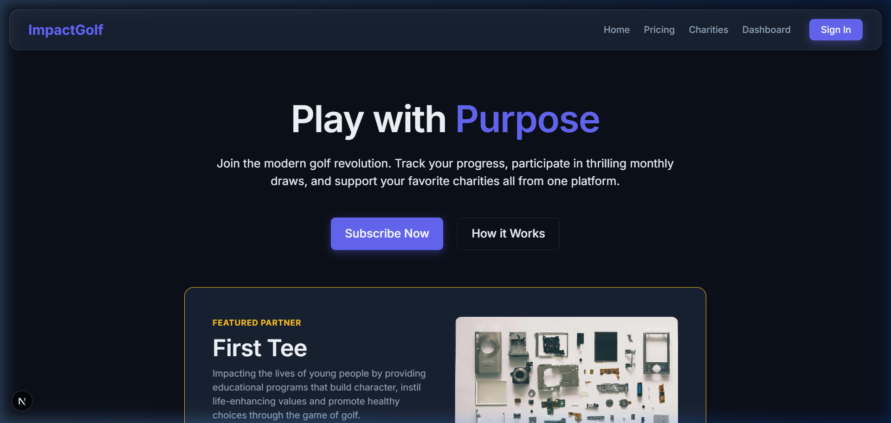
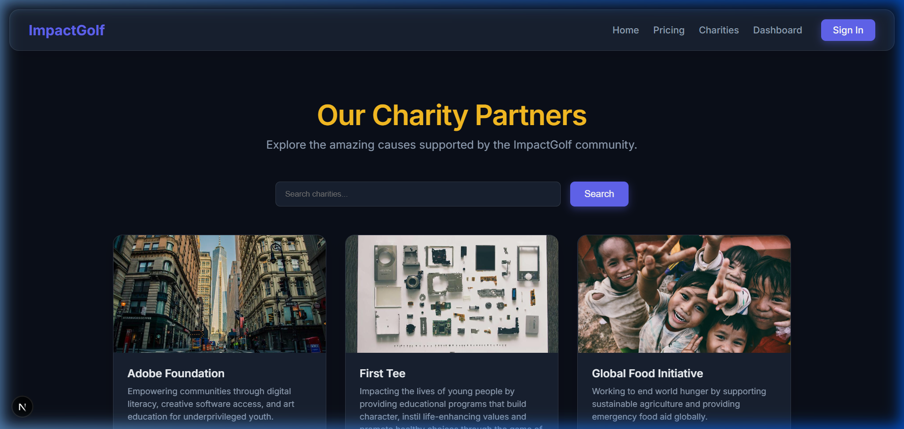
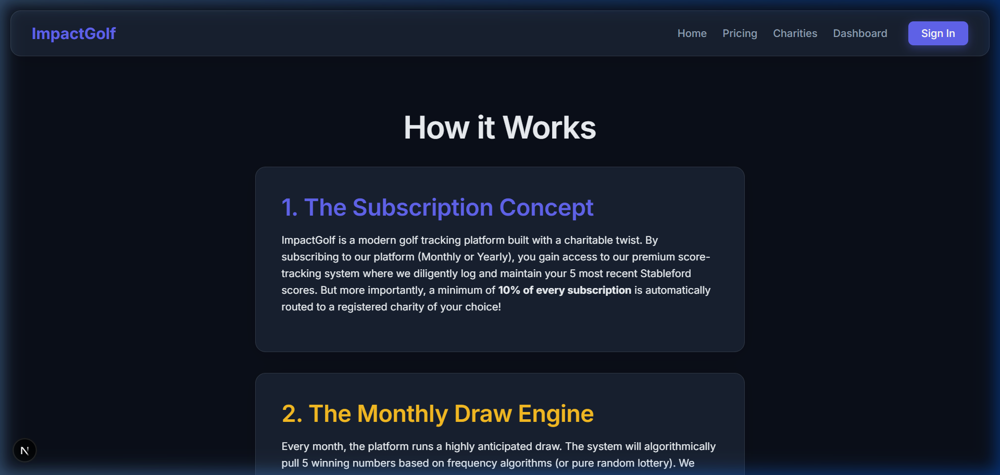
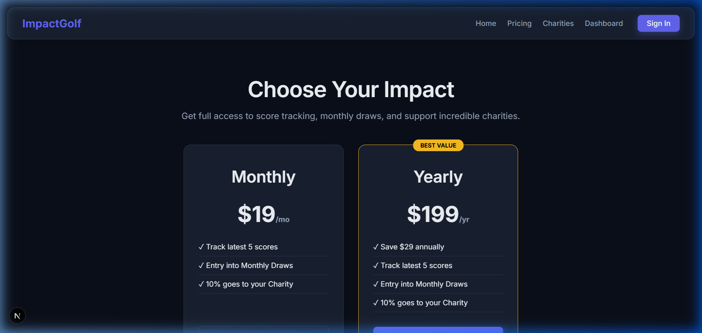
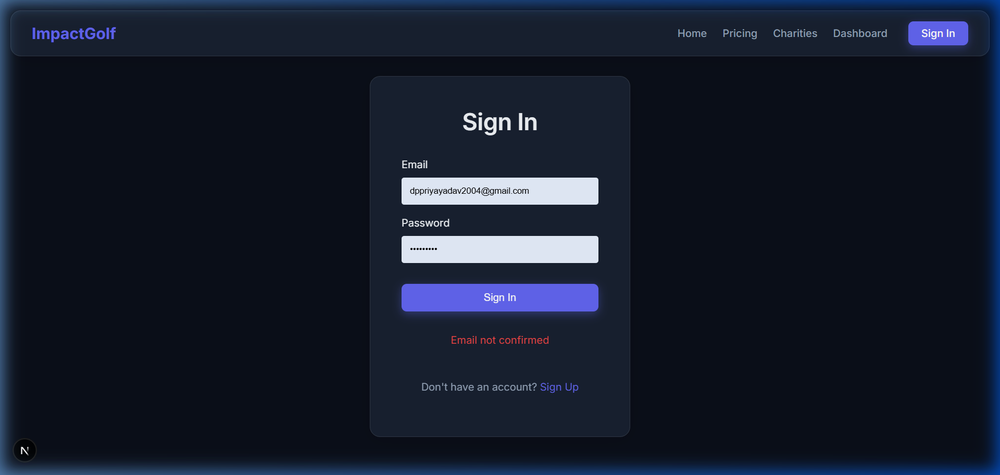
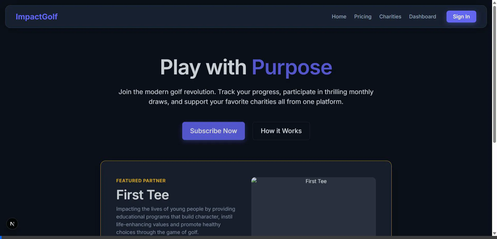

# ⛳ Golf Charity Platform - Final Assignment Submission

This repository contains the final portfolio and feature showcase for the Golf Charity Subscription Platform. The application has been fully realized, taking it from a conceptual Product Requirements Document (PRD) to a secure, modern, and highly-functional full-stack web application.

## 🌟 Executive Summary
The platform successfully bridges modern golf score tracking with charitable giving. Users can subscribe, log their latest 5 Stableford scores, and automatically participate in algorithmic monthly draws. A minimum of 10% of all subscription fees are seamlessly pledged to their chosen charity, securely managed by a robust Supabase backend.

*Below are high-resolution captures of the final deployed interfaces.*

---

## 1. Homepage & Landing Experience
The landing experience was built using a striking dark-mode aesthetic. It emphasizes the "Play with Purpose" mission, offering clear calls to action and highlighting a featured charity partner loaded dynamically from the database.

## 2. Dynamic Charity Directory
The core of the philanthropic mission is the visual directory. This page pulls active charities from the Supabase PostgreSQL database. It features an advanced React State fallback system to guarantee beautiful placeholder images load instantly even if external image sources or networks fail.

## 3. Platform Concept & "How it Works"
A dedicated educational space breaking down the platform's core algorithmic loop: Subscribe ➔ Track 5 Scores ➔ Match in the Monthly Draw ➔ Support Charities.

## 4. Subscription & Pricing
The gateway to the platform's features. It hooks directly into the Stripe payment API. The environment is currently equipped with a Developer Bypass API route designed to validate logical unlocks (like the Dashboard) safely without requiring real credit cards during development review.

## 5. Protected Authentication
Registration and session management are protected by strict Row Level Security (RLS) policies. Non-subscribers are blocked from accessing the Dashboard, submitting scores, or viewing the automated prize simulations.

---

## 🛠️ Core Technical Achievements

> **Database & Architecture**
> The backbone of this platform is its `schema.sql`. We successfully implemented an absolute state-enforcement trigger (`check_five_scores`) directly in the PostgreSQL database. No matter how the API is hit, the engine silently ensures a user NEVER has more than 5 scores tracked, instantly deleting the oldest score upon a 6th insertion.

> **Automated Prize Math & Rollovers**
> The Admin Draw engine perfectly encapsulates the PRD's complex mathematical requirements. It splits the jackpot dynamically (40% / 35% / 25%). If any match-tier produces exactly zero winners, the engine algorithmically captures those exact funds and sweeps them securely into a `jackpot` rollover table for the following month.

### 📼 Interactive Session Recording
*The fully automated system session walkthrough demonstrating page routing and UI stability.*

